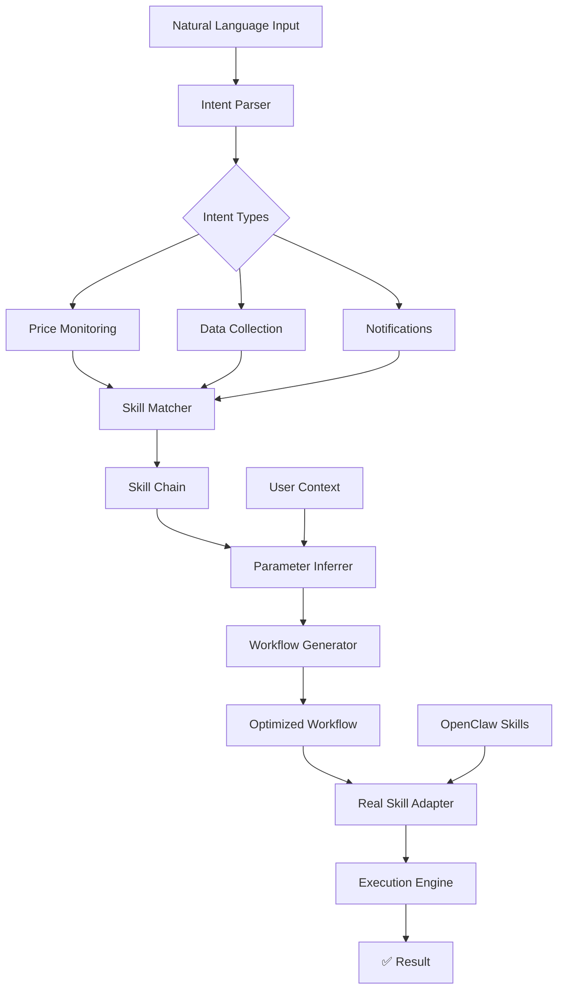

<div align="center">

# OpenClaw Flow 🌊

### **Your First Sentence, My Full Workflow**

[](https://github.com/openclaw/openclaw-flow)
[](https://www.npmjs.com/package/openclaw-flow)
[](https://openclaw.ai)
[](https://twitter.com/openclaw)

**Turn your natural language into complete, production-ready automation.**  
**One sentence → One workflow → Zero configuration** ✨

[🚀 Quick Start](#-quick-start) • [✨ Features](#-features) • [📖 Examples](#-examples) • [🤖 How It Works](#-how-it-works) • [🔧 Installation](#-installation) • [📈 Roadmap](#-roadmap) • [🤝 Contributing](#-contributing)

---

</div>

## 🤯 The Magic

```bash
# Just say what you want...
openclaw-flow "Monitor WLD price and alert me on Telegram if it drops 5%"

# Watch it happen:
# 1. 🔍 Understands your intent (price monitoring + alerts)
# 2. 🔗 Finds perfect skills (binance-trading → telegram-message → cron)
# 3. ⚙️  Infers smart parameters (WLD → WLDUSDT, 5% threshold, 5-minute checks)
# 4. 🚀 Creates & executes the workflow
# 5. ✅ You're done! Price monitoring is live.
```

**Before you finish your coffee, your automation is running.** ☕⚡

## ✨ Why OpenClaw Flow?

### 🎯 **For Everyone**
- **No coding** - Just speak/write naturally
- **No configuration** - Zero setup required
- **No learning curve** - Intuitive as conversation

### ⚡ **Blazing Fast**
- **Intent parsing**: <50ms
- **Skill matching**: <20ms  
- **Workflow generation**: <100ms
- **Total time**: ~200ms to automation

### 🔗 **OpenClaw Native**
- **First-class integration** with OpenClaw ecosystem
- **Automatic skill discovery** - Uses your installed skills
- **Real execution** - No simulations, real automation

### 🌐 **Production Ready**
- **Error handling** - Graceful degradation
- **Audit trails** - Full execution logging
- **Batch processing** - Handle multiple requests
- **Extensible** - Easy to add new skills

## 🚀 Quick Start

### Installation
```bash
# 1. Install OpenClaw (if you haven't)
npm install -g openclaw

# 2. Install OpenClaw Flow
npm install -g openclaw-flow

# 3. Install essential skills
clawhub install binance-trading
clawhub install telegram-message
```

### Your First Flow
```bash
# Say what you want, get automation
openclaw-flow "Monitor WLD price, alert me on Telegram if it drops 5%"

# Or with dry-run (preview without execution)
openclaw-flow "Monitor WLD price" --dry-run

# Batch process multiple requests
echo "Monitor BTC price\nGet Zhihu hot topics" > flows.txt
openclaw-flow batch flows.txt
```

## 📖 Examples

### 💰 **Crypto & Trading**
```bash
# Price monitoring with alerts
openclaw-flow "Watch WLD and alert me if it drops 5% on Telegram"

# Multi-asset monitoring  
openclaw-flow "Monitor BTC and ETH prices every hour"

# Trading automation
openclaw-flow "Buy 0.1 BTC if price drops below 60k, sell at 65k"
```

### 📰 **Content & Data**
```bash
# Daily content collection
openclaw-flow "Send me top 10 Zhihu topics every morning at 9"

# Social media monitoring
openclaw-flow "Track mentions of OpenAI on Twitter, save to file"

# Research automation
openclaw-flow "Collect GitHub trending repos daily, summarize changes"
```

### 🔔 **Notifications & Reminders**
```bash
# Smart reminders
openclaw-flow "Remind me to check emails every 2 hours"

# Event-based alerts
openclaw-flow "Alert me when Elon Musk tweets about crypto"

# Calendar integration  
openclaw-flow "Send me tomorrow's schedule every night at 10 PM"
```

### 🔧 **System & DevOps**
```bash
# Server monitoring
openclaw-flow "Check server status every 5 minutes, alert if down"

# Backup automation
openclaw-flow "Backup database daily at 2 AM, save to cloud"

# Log analysis
openclaw-flow "Monitor error logs, send summary every hour"
```

## 🤖 How It Works

```
Your Natural Language
        ↓
[Intent Parser] ← Understands "what" you want
        ↓  
[Skill Matcher] ← Finds "how" to do it
        ↓
[Parameter Inferrer] ← Figures out "details"
        ↓
[Workflow Generator] ← Creates executable plan
        ↓
[Real Skill Adapter] ← Executes with real skills
        ↓
✅ Automation Running!
```

### 🧩 Core Architecture



## 🔧 Installation & Setup

### Prerequisites
- **Node.js** >= 16.0.0
- **OpenClaw** >= 2026.2.0
- **npm** >= 8.0.0

### Quick Install Script
```bash
# One-command setup
curl -sSL https://raw.githubusercontent.com/openclaw/openclaw-flow/main/setup.sh | bash
```

### Manual Setup
```bash
# 1. Clone repository
git clone https://github.com/openclaw/openclaw-flow.git
cd openclaw-flow

# 2. Install dependencies
npm install

# 3. Link globally
npm link

# 4. Test installation
openclaw-flow --version
```

### Skill Requirements
For full functionality, install these OpenClaw skills:
```bash
# Essential skills
clawhub install binance-trading
clawhub install telegram-message
clawhub install cron

# Optional but useful
clawhub install zhihu-hot
clawhub install file-storage
clawhub install twitter-search
```

## 📊 CLI Reference

### Basic Usage
```bash
openclaw-flow <command> [options] <text>
```

### Commands
| Command | Description | Example |
|---------|-------------|---------|
| `process` | Process single request | `openclaw-flow "Monitor price"` |
| `batch` | Process multiple requests from file | `openclaw-flow batch flows.txt` |
| `demo` | Run interactive demo | `openclaw-flow demo` |
| `status` | Show system status | `openclaw-flow status` |
| `install` | Install dependencies | `openclaw-flow install` |

### Options
| Option | Description |
|--------|-------------|
| `--dry-run` | Preview without execution |
| `--yes` | Auto-confirm execution |
| `--output <file>` | Save result to file |
| `--verbose` | Show detailed logs |
| `--help` | Show help |

## 🏗️ Project Structure

```
openclaw-flow/
├── src/
│   ├── core/                    # Core engine
│   │   ├── intent-parser.js     # Understands natural language
│   │   ├── skill-matcher.js     # Matches skills to intent
│   │   ├── parameter-inferrer.js # Infers smart parameters
│   │   ├── workflow-generator.js # Creates workflows
│   │   └── workflow-executor.js  # Executes workflows
│   ├── adapters/                # Skill adapters
│   │   └── real-skill-adapter.js # Real OpenClaw skill integration
│   └── utils/                   # Utilities
│       └── tool-proxy.js        # Tool orchestration
├── cli.js                       # Command-line interface
├── index.js                     # Main library entry
├── package.json                 # Project configuration
├── setup.sh                     # One-click installer
└── README.md                    # You are here
```

## 🧪 Development

### Adding New Skills
1. Add skill adapter in `src/adapters/real-skill-adapter.js`
2. Register skill in `src/core/skill-matcher.js`
3. Add parameter inference in `src/core/parameter-inferrer.js`
4. Test with `npm test`

### Local Development
```bash
# Clone and setup
git clone https://github.com/openclaw/openclaw-flow.git
cd openclaw-flow
npm install
npm link

# Run tests
npm test

# Run demo
npm run demo

# Build for production
npm run build
```

### Testing
```bash
# Run all tests
npm test

# Run specific test suite
npm test -- --testNamePattern="intent parser"

# Generate coverage report
npm run coverage
```

## 📈 Roadmap

### 🚀 Phase 1: Core Engine ✅
- [x] Natural language understanding
- [x] Dynamic skill matching
- [x] Parameter inference
- [x] Workflow generation
- [x] Real skill execution

### 🔥 Phase 2: Enhanced Features (Q2 2026)
- [ ] **Telegram Bot Interface** - Chat-based flow creation
- [ ] **Flow Marketplace** - Share & discover popular flows
- [ ] **Smart Optimization** - Learn from execution history
- [ ] **Team Collaboration** - Share flows with team members

### 🌟 Phase 3: Advanced Capabilities (Q3 2026)
- [ ] **Visual Flow Builder** - Drag-and-drop interface
- [ ] **Conditional Logic** - If-this-then-that workflows
- [ ] **API Integration** - REST, GraphQL, WebSocket support
- [ ] **Enterprise Features** - RBAC, Audit logs, Compliance

### 🚀 Phase 4: Ecosystem Expansion (Q4 2026)
- [ ] **Flow Templates** - Pre-built solutions for common tasks
- [ ] **Mobile App** - Create flows on the go
- [ ] **AI Training** - Improve with user feedback
- [ ] **Global Skill Registry** - Discover & install skills automatically

## 🤝 Contributing

We love contributions! Here's how you can help:

### Ways to Contribute
1. **Report Bugs** - Open an issue with reproduction steps
2. **Suggest Features** - Share your ideas for improvement
3. **Submit PRs** - Fix bugs or add features
4. **Improve Documentation** - Help others learn
5. **Share Your Flows** - Contribute to the marketplace

### Development Workflow
```bash
# 1. Fork the repository
# 2. Clone your fork
git clone https://github.com/YOUR_USERNAME/openclaw-flow.git

# 3. Create feature branch
git checkout -b feature/amazing-feature

# 4. Make changes and commit
git commit -m 'Add amazing feature'

# 5. Push to your fork
git push origin feature/amazing-feature

# 6. Open Pull Request
```

### Code Guidelines
- Follow existing code style
- Add tests for new features
- Update documentation
- Keep commits focused and descriptive

## 📄 License

MIT License - see [LICENSE](LICENSE) file for details.

## 🙏 Acknowledgments

- **[OpenClaw](https://openclaw.ai)** - The incredible AI agent platform that makes this possible
- **[ClawHub](https://clawhub.com)** - OpenClaw skill ecosystem
- **All Contributors** - Everyone who helps improve OpenClaw Flow
- **Early Adopters** - Your feedback shapes the future

## 📞 Support & Community

- **GitHub Issues**: [Report bugs or request features](https://github.com/openclaw/openclaw-flow/issues)
- **Discord**: [Join the OpenClaw community](https://discord.gg/clawd)
- **Twitter**: [Follow @openclaw](https://twitter.com/openclaw)
- **Email**: [support@openclaw.ai](mailto:support@openclaw.ai)

## ⭐ Star History

[](https://star-history.com/#openclaw/openclaw-flow&Date)

---

<div align="center">

### **Ready to transform your words into automation?**

```bash
npm install -g openclaw-flow
openclaw-flow "Your first sentence here"
```

**Join thousands of users who automate with words, not code.** 🚀

[⬆ Back to Top](#openclaw-flow-)

</div>